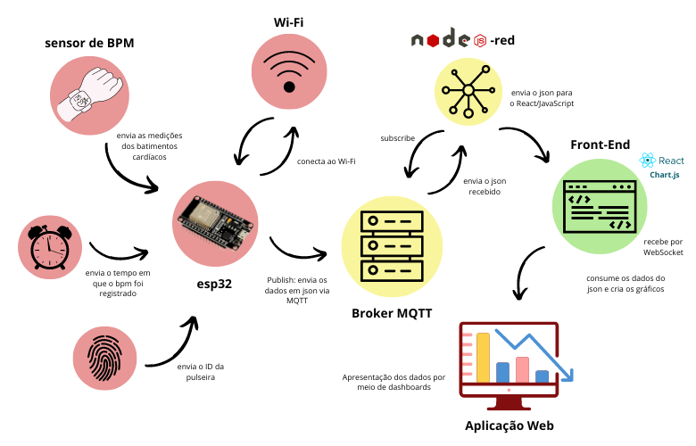
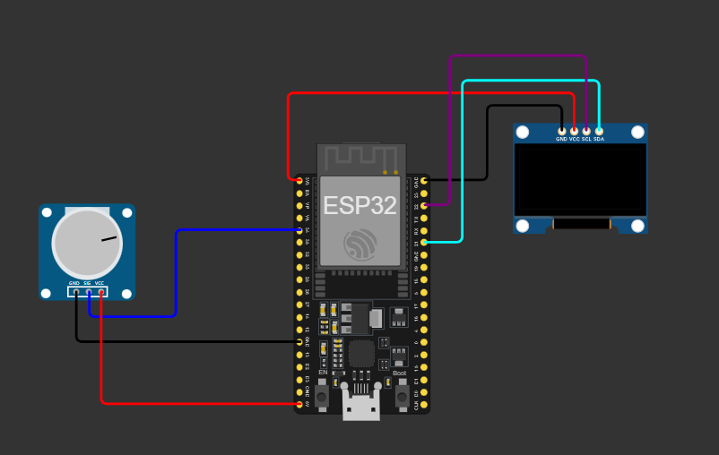
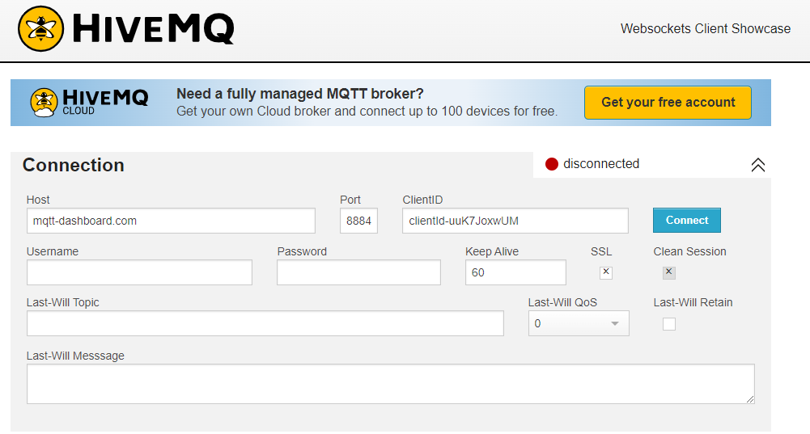
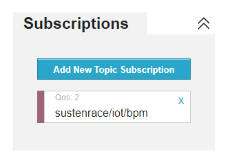
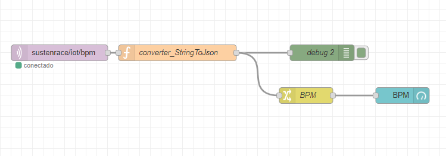
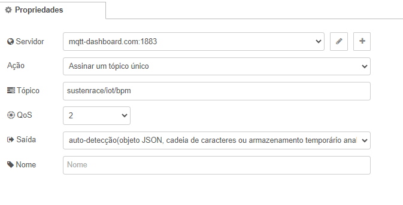
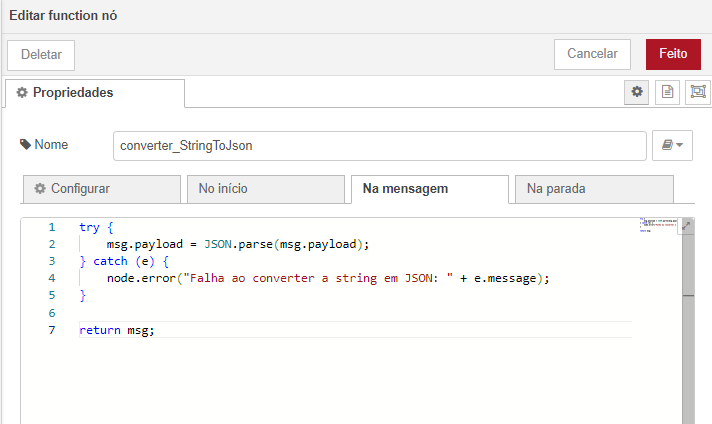
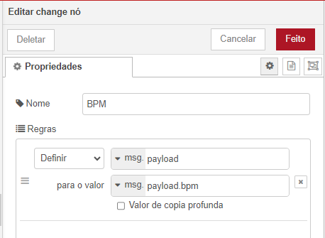
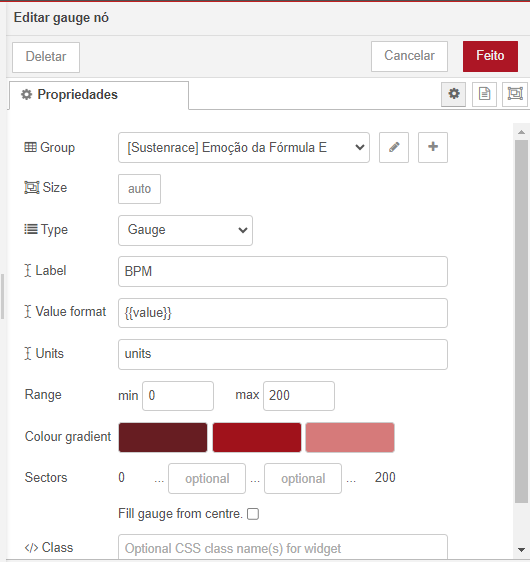
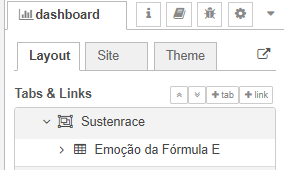

<h1 align=center>Sustenrace</h1>

A Sustenrace nasceu de uma parceria com a Mahindra, com o desafio de popularizar a Fórmula E através de uma aplicação web inovadora. Nossa missão é unir educação e tecnologia, oferecendo uma experiência interativa e envolvente que aproxima o público do universo dos carros elétricos, promovendo inovação e novas formas de aprendizado.

Para concretizar esse objetivo, criamos uma plataforma interativa que conecta os entusiastas de automobilismo e corridas. Um dos destaques da nossa solução são os modelos 3D gamificados dos carros, que oferecem uma experiência imersiva e divertida para os usuários - para mais informações, consulte o repositório <a href="https://github.com/brunacostaz/Sustenrace">da aplicação web da Sustenrace</a>.

Além disso, para desmistificar o mito de que "sem o barulho do motor não há emoção", desenvolvemos um sistema de IoT integrado a uma pulseira, capaz de monitorar os batimentos cardíacos do público durante as corridas. Esses dados serão transmitidos para o nosso site, onde serão apresentados e analisados em tempo real, permitindo que os espectadores vivenciem a emoção da corrida de uma forma totalmente nova. 

## 📃 Descrição Geral

O projeto é composto por três principais componentes:

1. Sensor de Batimento Cardíaco:

* No momento, usamos um potenciômetro para simular a leitura de batimentos cardíacos feita pelo sensor específico (devido a sua ausência no simulador Wokwi).

2. Display OLED de 128x64 pixels:

* Através de um código que desenha o BPM, com base nos valores fornecidos pelo potenciômetro, ocorre a exibição dos batimentos em um display OLED de 128x64 pixels.

3. Esp32:

* Migramos a versão inicial do projeto para o Esp32, pois ele oferece conexão com Wi-Fi que é um recurso indispensável para o nosso projeto.

## 🌐 Arquitetura de Redes

## 🖥️ Requisitos de Software

#### Bibliotecas para o Esp32
Para o projeto funcionar, você deve instalar as seguintes bibliotecas (ao baixar, não digite o .h após o nome da lib, isso só deve ser colocado no momento de importá-las para o código):

* `WiFi.h`: Fornece as funcionalidades necessárias para conectar dispositivos ESP32 ou ESP8266 a redes Wi-Fi, permitindo a comunicação com a internet e outros dispositivos conectados.

* `time.h`: Biblioteca usada para manipular funções relacionadas ao tempo e data no Arduino, como obter a hora atual de um servidor NTP (Network Time Protocol) - necessário para enviar o momento exato em que o BPM foi medido.

* `ArduinoJson.h`: Uma biblioteca leve para a manipulação de dados JSON, facilitando a criação, leitura e análise de objetos e arrays JSON em projetos Arduino.

* `PubSubClient.h`: Implementa o protocolo MQTT (Message Queuing Telemetry Transport), permitindo que dispositivos se comuniquem com servidores MQTT para publicar ou se inscrever em tópicos.

* `U8g2lib.h`: Biblioteca para controlar displays gráficos baseados em controladores monocromáticos como OLED, LCD, e ePaper, suportando fontes e gráficos para exibir textos e imagens.

#### Plataformas de execução

* `Wokwi`: caso não tenha os componentes físicos ou, simplesmente, queira executar pelo simulador, utilize essa plataforma e monte o circuito conforme a imagem abaixo (detalhes disponíveis na sessão seguinte "Como montar o projeto")

Link Wokwi: https://wokwi.com/

   

* `Arduino IDE`: caso possua os componentes, baixe a IDE do Arduino: https://www.arduino.cc/en/software 

### 🛠️ Como montar o projeto
 

**Conexão do Potenciômetro**

| Pino Potenciômetro	| Pino Esp32                                      |
| ------------------- | ------------------------------------------------- |
| VCC                 | 5V                                                |
| GND                 | GND                                               |
| Sinal               | 34                                                |

 

**Conexão do Display OLED**     

| Pino OLED         | Pino Esp32                                                   |
| ----------------- | -------------------------------------------------------------- |
| VCC               | 3V3                                                 |
| GND               | GND                                             |
| SCL               | 22                                                             |
| SDA               | 21                                                             |

 

### HiveMQ 

Para a transmissão dos dados via MQTT, utilizamos o broker <a href="https://www.hivemq.com/demos/websocket-client/">HiveMQ</a>

O link acima te direcionará para a interface de conexão com o broker, onde você receberá todas as informações. 

Mantenha as configurações confome a imagem a seguir:

  

Caso deseje, pode inserir um username da sua preferência.

Após clicar em `Connect`, você estará conectado no broker.

Se inscreva no tópico `sustenrace/iot/bpm` e seu broker estará pronto para receber os dados do Esp32

 

### Node e Node-Red

Node.js é um ambiente de execução JavaScript construído sobre o motor V8 do Chrome. Ele permite executar código JavaScript no lado do servidor, fora do navegador, possibilitando o desenvolvimento de aplicações escaláveis e de alto desempenho.

A partir dele, foi construído o Node-Red, que é uma ferramenta de desenvolvimento baseada em fluxo que permite a conexão de dispositivos de hardware, APIs e serviços online de maneira visual e simplificada. 

Baixe o Node.js: https://nodejs.org/pt
Baixe o Node-Red: https://nodered.org/

### Fluxo Node-Red

Siga o passo a passo para criar o seu fluxo no node-red

* Após a instalação via command prompt, digite `node-red` para iniciar o servidor
* Copie o endereço de URL que ele disponibilizará ao final e cole no seu navegador
* Monte o fluxo abaixo:

  

* Adicione um `mqtt in` e configure-o com o host do HiveMQ e o Tópico que você está inscrito

  

* Adicione uma `function` e insira o código abaixo, para converter a String recebida pelo MQTT para JSON

  

* Adicione um `debug`, para verificar se a conexão está ocorrendo de maneira certa

* Adicione um `change`  para filtrar as informações somente do BPM, e assim gerar os gráficos

  

* Adicione um `gauge` e configure-o da seguinte forma

### Dashboards

Existem duas visualizações dos dashboards: pelo node-red e pela aplicação web

* Para visualizar os gráficos do node-red, você precisa baixar a biblioteca `@flowfuse/node-red-dashboard` pelo manage palette e executar o site fornecido (clicando na seta no canto superior direito):

  

* `🚧 em construção` Para visualizar pelo site da Sustenrace, basta clonar o repositório disponível no link a seguir (todo o passo a passo e dependências está no Readme): https://github.com/brunacostaz/Sustenrace 

